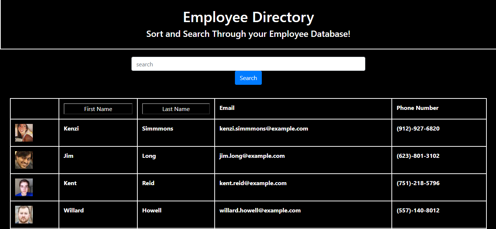
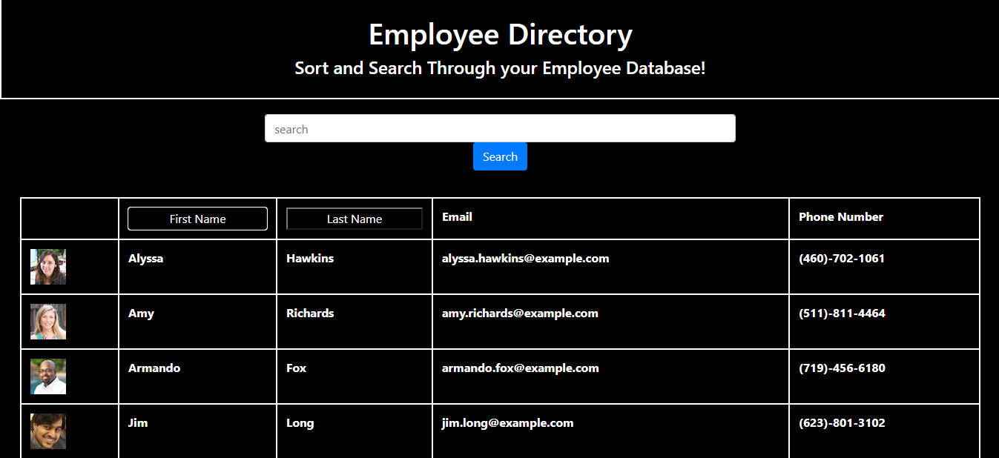
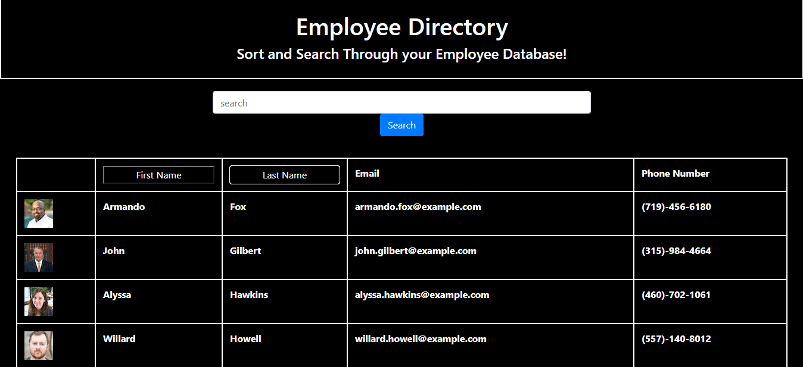
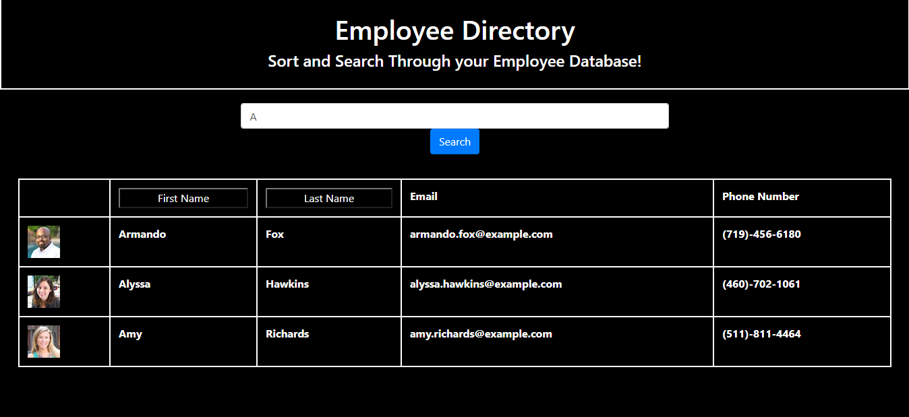
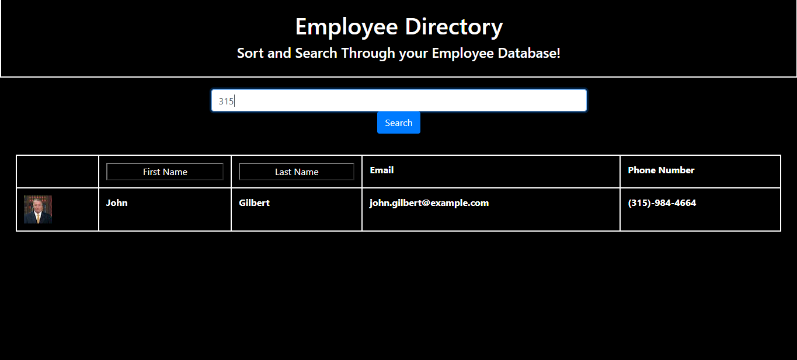

# React Employee Directory
### Created by Jordan Sarvay

## Description
Utilizes an API call to randomuser.me in order to generate a database of employees with the functionality to search through and sort, all in React!

[Deployed Link](https://jsarvay.github.io/React-Employee-Directory/)

## Table of Contents
* [Installation](#installation)
* [Usage](#usage)
* [Contributing](#contributing)
* [Testing](#testing)
* [Questions](#questions)
    
## Installation

This app is hosted Github Pages and requires no installation on the user end.
    
## Usage

Simply visit the deployed page and you will be able to use the app. You can search by any column listed in the table, the state array will be matched against whatever is in the input field when submitted and display any results that match what is entered, whether by First Name, Last Name, Phone Number, or Email. The results can also be sorted by First Name or Last Name by Clicking the appropriate column header.
    
## Contributing

If you are interested in contributing to this project, reach out to the creator to have a working branch established to upload to. All branches will be merged by the content creator to ensure a consistent app experience before being uploaded to the deployed version at Github.

## Testing

No test files were created for this app, though in future deployment they will be created and run through JEST.
    
## Questions

Please feel free to reach out to either of the following links with questions regarding the use of this application.

##### Github: [JSarvay](http://github.com/JSarvay/)
##### E-mail: jordans1@vt.edu

Standard Landing page for the app.

Shows the employees sorted by their first name.

Shows the employees sorted by their last name.

Shows the employees searched by first letter of their names.

Shows the employees searched by their area code.